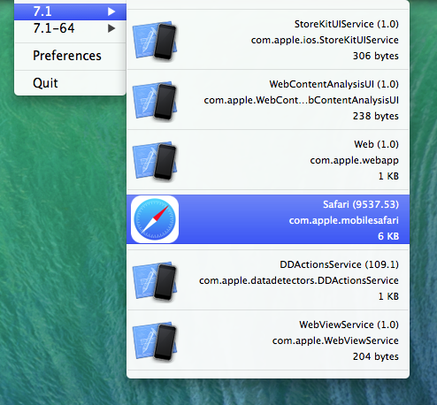

# SimLink

SimLink is a small utility that lives in the status bar. It gives you easy and fast access to all iPhone Simulator versions and all applications that are installed under them.

## Features

SimLink v0.1:

* List application's name, bundle identifier, version and size
* Renders icon as defined in info.plist (Hardcoded as of now)
* Open application's folder in Finder with a single (Click)
* Launch an application in the iPhone Simulator (⌘ + Click) (Only user apps)
* Delete an application (⌘ + ⌥ + ⌃ + Click)

## Current Limitations

* Launching in Simulator requires Xcode 5.1
* Application's icon is hardcoded to use "icon@2x\~{ipad, iphone}.png"
* Simulator SDK is hardcoded to use system default
* Simulator Device Family is hardcoded to "iPad"
* No handling for empty menus
* Menu highlighting is bugged and needs optimising
* System applications are always visible
* System applications cannot be launched in Simulator

## Roadmap

* Features & Cleanup:
	* Get rid of all hardcoded stuff
	* Implement proper application's icon parsing
	* Implement xcassets parsing
	* Implement a start dialog with possible simulator settings before launching an application
	* Add Simulator configuration possibility
* Further menu actions:
	* Delete contents of Documents/Library folder
	* View apllication's User Defaults stored in Preferences folder
* Application preferences with the following possible settings:
	* Start at login
	* Key bindings
	* Show/Hide system applications
	* Default Simulator settings (SDK, Device Family ... etc)
	* Notification Center integration
* An icon, for the app itself and for the status bar
* ...

## License

SimLink is licensed under the [MIT Licence](LICENSE)
